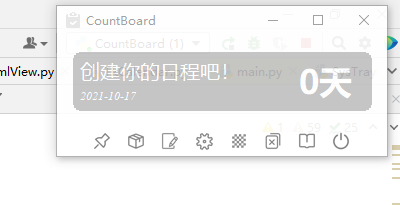
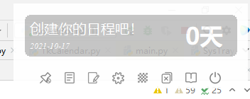
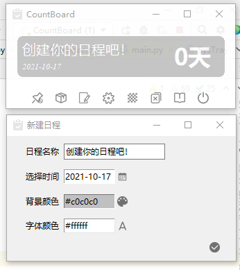

 

CountBoard 是一个基于Tkinter简单的,开源的桌面日程倒计时应用。

## 基本功能
* 置顶功能  
    * 是否使窗体一直保持在最上面。  
* 简洁模式  
    * 简洁模式使窗体更加简洁。  
    * 此模式下不可调整大小,请提前在普通模式下调整大小。  
* 设置功能  
    * 修改主窗体背景颜色,修改计时模式。  
* 透明设置  
    * 调整窗体的透明度。  
* 修改功能  
    * 双击日程可修改或者删除。  
* 计时模式
   * 普通模式指24小时以内算做一天。    
   * 紧迫模式指24小时以内算做零天。

## 开源地址
* <https://github.com/Gaoyongxian666/CountBoard>

## 反馈建议 & 检查更新
* [吾爱破解](https://www.52pojie.cn/thread-1529077-1-1.html)

## 推荐配色
* 主题颜色设置浅色 或者 主题颜色和日程背景颜色一致.
* 颜色可以直接选择输入英文颜色,例如Navy是海军蓝,RoyalBlue是皇家蓝.

## 预览图
  

  

 

## 更新日志
* V1.0
   * 2021-10-16：完成基本功能
